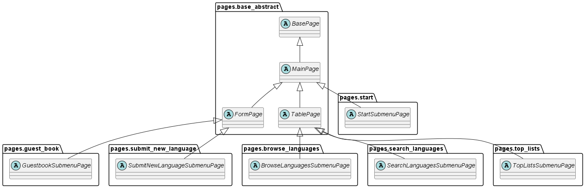
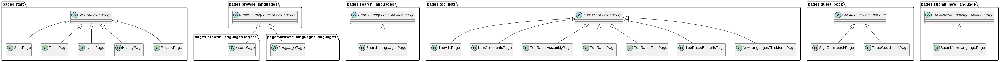
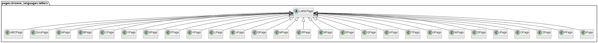
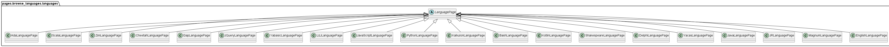

<h1>Java 11 | Selenium | TestNG | Maven | POM Project</h1>

This is a sample Java 11 AdoptOpenJDK | Selenium WebDriver | Maven | TestNG project created in IntelliJ IDE, using Page Object Model and Generic Type.

Website <a href="https://www.99-bottles-of-beer.net/">https://www.99-bottles-of-beer.net/</a>&nbsp;was used to create functional, API, and UI tests.

<strong>pom.xml dependencies used:</strong>

<blockquote>
<pre>&lt;dependencies&gt;      &lt;dependency&gt;         &lt;groupId&gt;org.testng&lt;/groupId&gt;         &lt;artifactId&gt;testng&lt;/artifactId&gt;         &lt;version&gt;7.6.1&lt;/version&gt;     &lt;/dependency&gt;      &lt;dependency&gt;         &lt;groupId&gt;org.seleniumhq.selenium&lt;/groupId&gt;         &lt;artifactId&gt;selenium-java&lt;/artifactId&gt;         &lt;version&gt;4.5.3&lt;/version&gt;     &lt;/dependency&gt;      &lt;dependency&gt;         &lt;groupId&gt;io.github.bonigarcia&lt;/groupId&gt;         &lt;artifactId&gt;webdrivermanager&lt;/artifactId&gt;         &lt;version&gt;5.3.0&lt;/version&gt;     &lt;/dependency&gt;  &lt;/dependencies&gt;</pre>
</blockquote>
<h1>API testing</h1>

For testing requests and responses&nbsp;<strong>DevTools&nbsp;type property</strong> was used&nbsp;

<blockquote>
<pre>&nbsp; DevTools devTools;  </pre>
</blockquote>

<strong>setUpDevTool(WebDriver driver)&nbsp;</strong> method was created in the class CaptureNetworkTraffic &nbsp;to capture the traffic:

<blockquote>
<pre> public&nbsp;CaptureNetworkTraffic setUpDevTool(WebDriver driver) { &nbsp; &nbsp; &nbsp;devTools&nbsp;= ((ChromeDriver) driver).getDevTools(); &nbsp; &nbsp; &nbsp;devTools.createSession(); &nbsp; &nbsp; &nbsp;devTools.send(Network.enable(Optional.empty(), Optional.empty(), Optional.empty())); &nbsp; &nbsp; &nbsp; &nbsp;return this; &nbsp;}&nbsp;</pre>
</blockquote>

<strong>org.openqa.selenium.devtools.v106.network.Network</strong>&nbsp;was used for traffic interception.

Class&nbsp;<strong>HttpURLConnection</strong>&nbsp;was used to send direct API calls and check responses.

<h1>POM scheme</h1>

